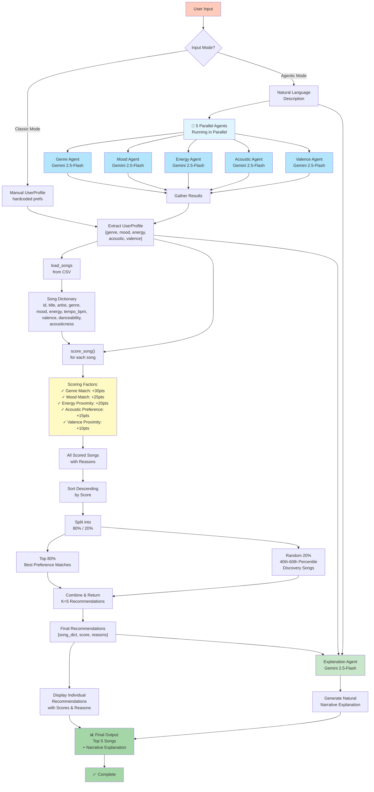

# Agentic Music Recommender - Complete Flow

## System Architecture



## Key Components

### 1. **Input Layer** (User Interaction)
- **Classic Mode**: Hardcoded `UserProfile` dictionary
- **Agentic Mode**: Natural language description processed by 5 parallel agents

### 2. **Agentic Extraction Layer** (NEW)
| Agent | Input | Output | Purpose |
|-------|-------|--------|---------|
| Genre Agent | "I want chill lofi" | "lofi" | Extract preferred genre |
| Mood Agent | "I want chill lofi" | "chill" | Extract desired mood |
| Energy Agent | "I want chill lofi" | 0.3 | Extract energy level (0.0-1.0) |
| Acoustic Agent | "I want chill lofi" | true | Detect acoustic preference |
| Valence Agent | "I want chill lofi" | 0.6 | Infer emotional positivity |

**Run Strategy**: All 5 agents execute in parallel using `asyncio.gather()` for optimal latency

### 3. **Scoring & Recommendation Logic** (Module 3 - Unchanged)
- `score_song()`: Evaluates each song against user preferences
- Factors: Genre, Mood, Energy proximity, Acoustic preference, Valence
- Returns score + reasons
- Sorts by score descending
- Splits: 80% top-scored + 20% discovery (40th-60th percentile for variety)

### 4. **Explanation Layer** (NEW)
- Takes user input, profile, and recommendations
- Generates a 2-3 sentence natural narrative
- Explains WHY each song matches the user's taste
- Uses Gemini to create conversational, non-mechanical explanations

### 5. **Output Layer**
- Individual song recommendations with scores & reasons
- Cohesive narrative explanation of the overall recommendation logic
- Personalized for the user's stated preferences

## Data Flow

```
Natural Language Input
    ↓
[5 Parallel Gemini Calls via asyncio]
    ↓
Extracted UserProfile
    ↓
load_songs() → Song Catalog
    ↓
score_song() × N [for all songs]
    ↓
Scored Songs + Reasons
    ↓
Sort & Split (80/20)
    ↓
Top 5 Recommendations
    ↓
[Display + Explanation Agent]
    ↓
Final Output with Narrative
```

## Technology Stack

| Layer | Technology |
|-------|-----------|
| Preference Extraction | Google Gemini 2.5-Flash (5 parallel agents) |
| Scoring Logic | Python (numpy/pandas operations) |
| Explanation | Google Gemini 2.5-Flash (narrative generation) |
| Async Orchestration | Python asyncio |
| API Key | GOOGLE_API_KEY (environment variable) |

## Run Modes

```bash
# Default: Agentic mode (natural language input)
python src/main.py

# Classic mode: hardcoded preferences
python src/main.py --classic
```

## Performance Notes

- **Agentic Extraction**: ~2-3 seconds (5 parallel Gemini calls)
- **Scoring**: O(N) where N = number of songs in catalog
- **Explanation Generation**: ~1-2 seconds (single Gemini call)
- **Total**: ~3-5 seconds end-to-end

---

*Integrates the original Module 3 scoring logic with new agentic workflow for natural language preference extraction and AI-generated explanations.*
